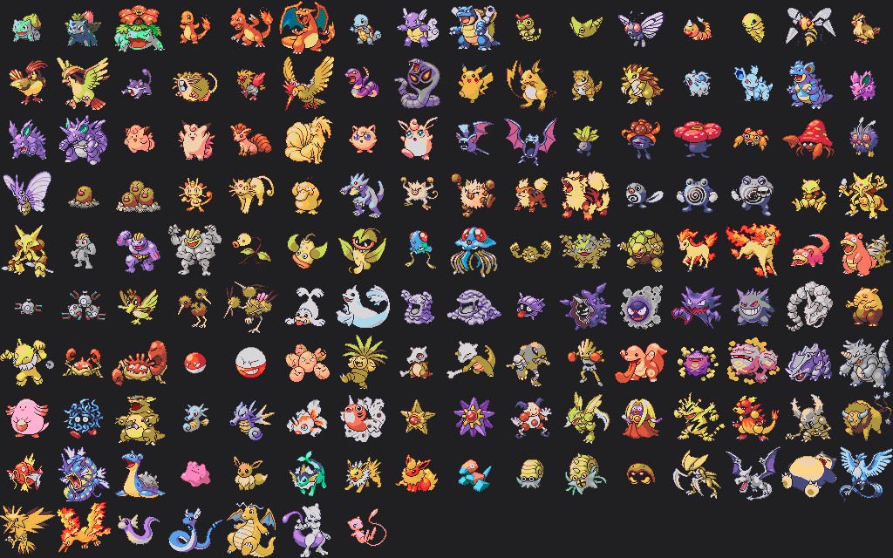

# fusebeads_project
Toy project to convert colors of a spritesheet to given palette of color (avaliable fusebead colors) and count number of each beads needed to complete project in fusebeads.

Input Spritesheet :

Output Spritesheet using a color palette scraped from screenshots of fusebeads : 

