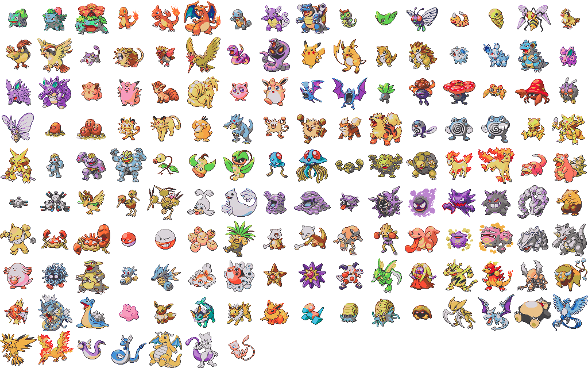

# fusebeads_project
Toy-project to convert each color in a spritesheet to closest color avaliable in given color palette (=avaliable fusebead colors).
Then count number of each pixel for each color (=number of each beads needed to complete the project in fusebeads).

Input Spritesheet :

Output Spritesheet using a color palette scraped from screenshots of fusebeads : 

